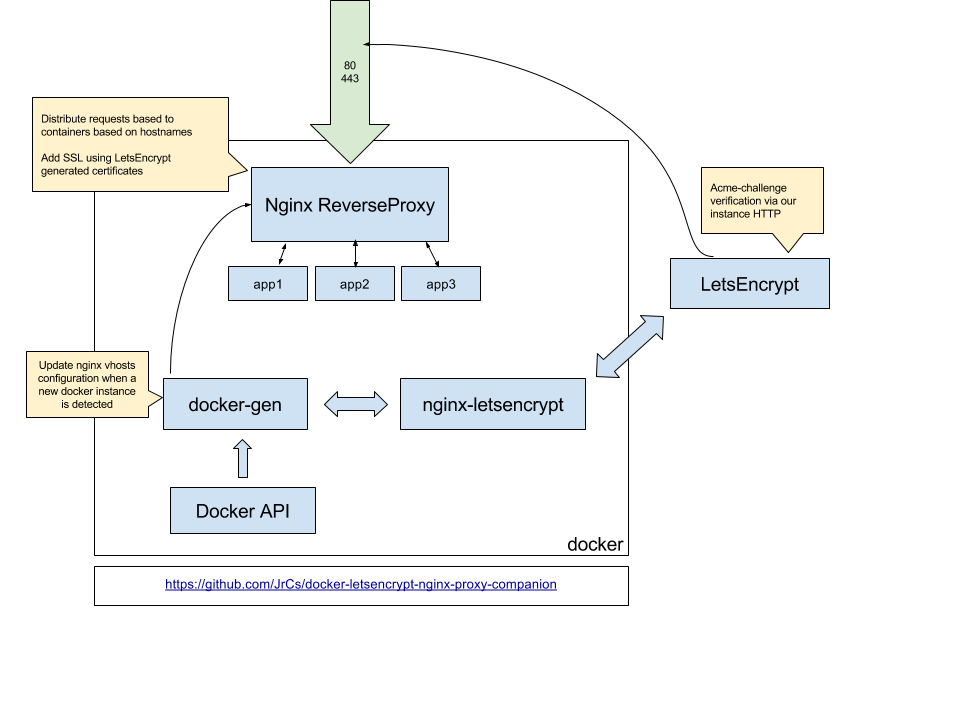

# info

Simple example of gitlab (gitlab/gitlab-ce docker container) that run behind nginx reverse proxy (jwilder/nginx-proxy) with valid autogenerated ssl certificates using letsencrypt-nginx-proxy-companion

- easy to setup
- auto generation and ssl certificate prolongation
- you can add as many services as you want (not just gitlab)

# prerequisites

- a server with real ip address
- docker, docker-compose on the server
- a domain or subdomain (for instance example.com) that points to your server

# use

- fork this repository
- change example data with real values in **gitlab/docker-compose.yml**

## start reverse proxy

    cd reverse-proxy
    docker-compose up -d

## start gitlab

    cd gitlab
    docker-compose up -d

# checklist

- [ ] target domain points to desired server (ping example.com)
- [ ] example data has been changed to real values in gitlab/docker-compose.yml
- [ ] go to example.com and check certificate
- [ ] check gitlab ssh on the desired port (ssh example.com -p 222)
- [ ] check your server for open ports (nmap example.com). Block unwanted open ports if necessary (ufw for debian bases distros)
- [ ] don't forget to change gitlab password asap (default root:root)